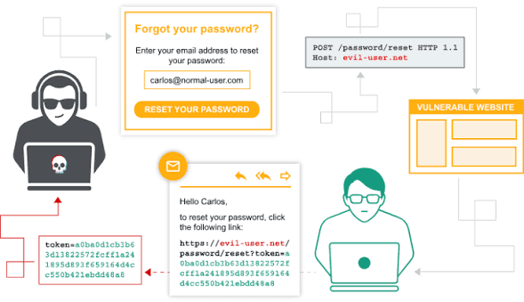

# Host-header poisoning

Host-header poisoning is an attack where you send a request with a fake value in the `Host` header (the part of a request that says which website you're trying to reach). The problem is that many servers trust this value and use it to build things like links, password-reset URLs, or loaded resources in the page. So an attacker can set the `Host` to a malicious domain, and the server bakes that domain into the response. A common example: you request a password reset, the server uses your fake `Host` to build the reset link in the email, and now the victim's reset link points to the attacker's site—handing over the token when they click it. It can also be combined with caching so the poisoned page gets served to many users at once.

<figure><figcaption></figcaption></figure>

***

**REFERENCE:**

https://portswigger.net/web-security/host-header

## host-header poisoning - checklist

### A. Password Reset Poisoning

* [ ] Navigate to "Forgot password" and submit a reset for your own account (e.g. : `tmp_username`).
* [ ] Intercept the `POST /forgot-password` request in Burp.
* [ ] Add the header `HEADER_X : <exploit-server>` and resend the request for `tmp_username`.
* [ ] Confirm in the logs (collaborator) that the reset link now contains the password reset token.
* [ ] Repeat the request with `username=carlos` (keeping `HEADER_X` pointed at your exploit server).
* [ ] Check the **Access Log** on the exploit server for an incoming `GET` request containing a reset token.
* [ ] Use the token to reset the user his password and log in.

### B. Host Validation Bypass via Connection State

* [ ] Send a normal `GET /` request to the target domain > confirm a `200 OK`.
* [ ] Send a `GET /admin` with `Host: 192.168.0.1` expect a `301` or block (validation kicks in).
* [ ] Create a **tab group** in Burp Repeater with two requests:
  * [ ] **Tab 1:** Normal `GET /` to the real domain (valid Host header).
  * [ ] **Tab 2:** `GET /admin` with `Host: 192.168.0.1`.
* [ ] Send via **"Send group (single connection)"** -- the front-end only validates the first request and lets the second one through.
* [ ] Confirm `200 OK` on the admin panel and perform the required action (e.g. delete a user).

### Try to update/add the values of 1 of the following headers:

* `Host`
* `X-Forwarded-Host`
* `X-Forwarded-For`
* `X-Host`
* `X-Forwarded-Server`

### important to note:

Connection state attacks exploit the fact that a reverse proxy/front-end only validates the **first request** on a TCP connection.
